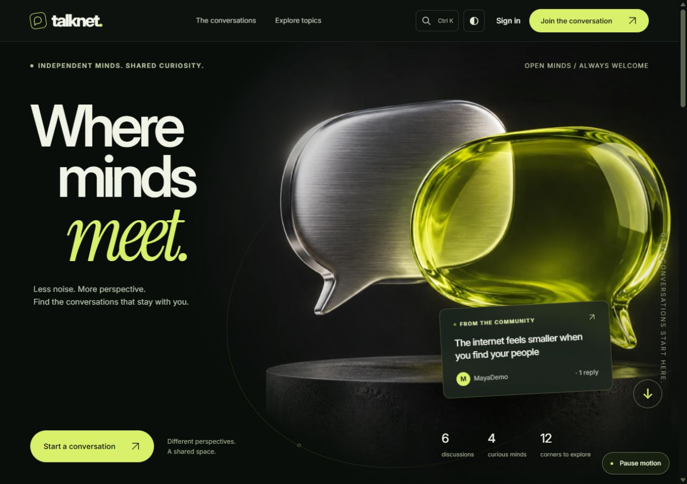
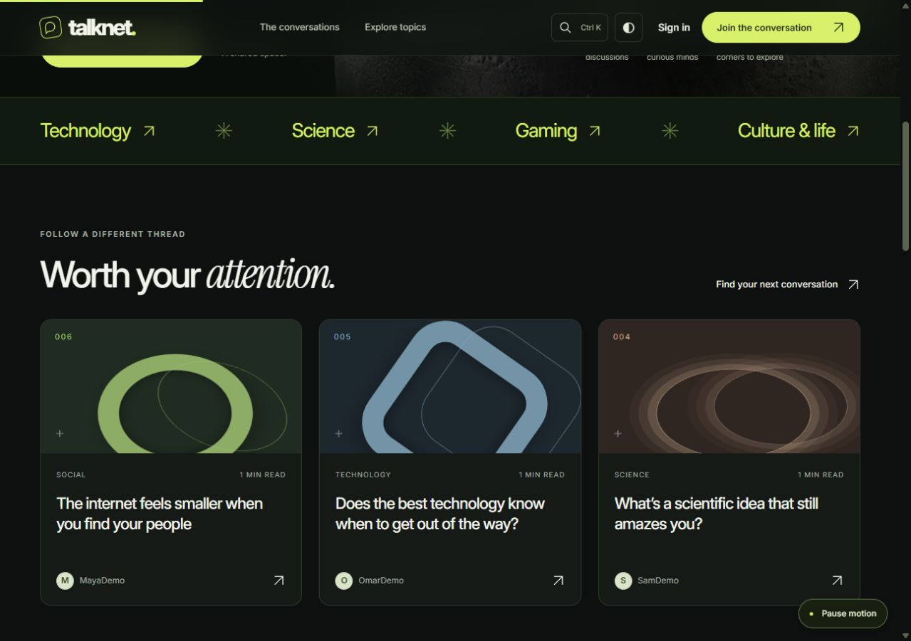
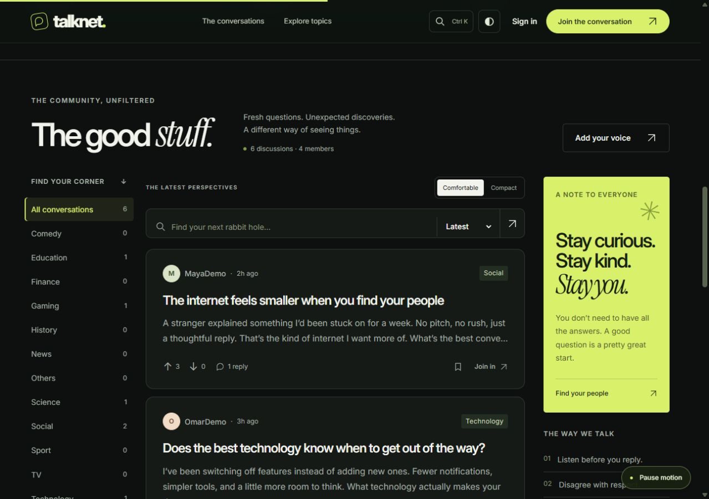
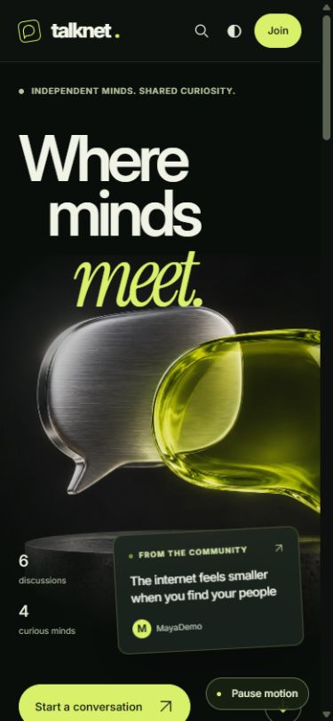
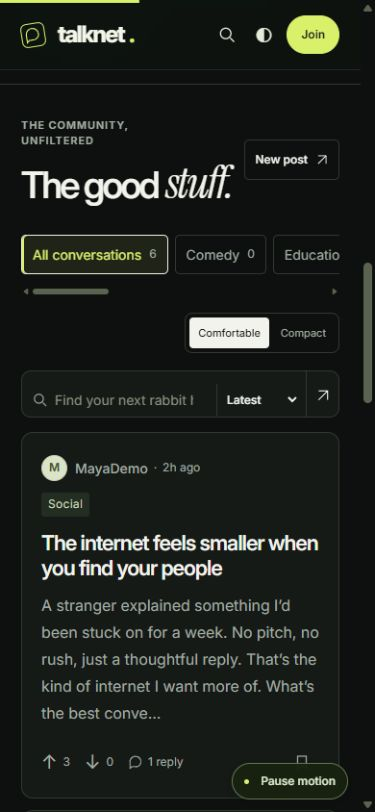
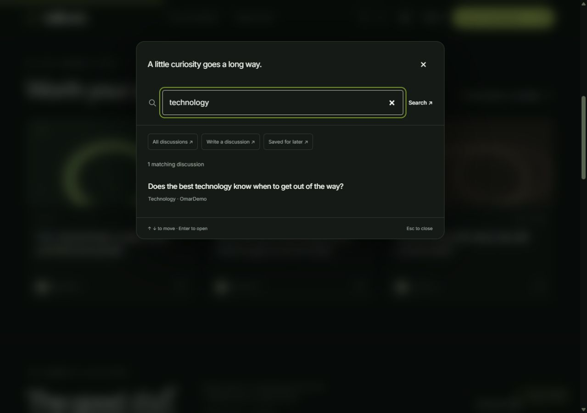
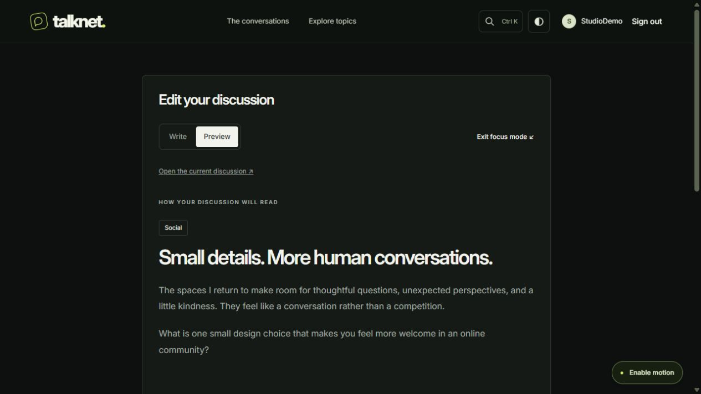
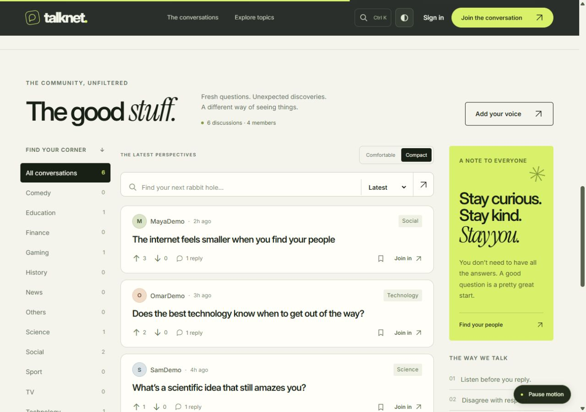

# Talknet

**Where minds meet.**

An immersive discussion community built with **Go + SQLite**. Chrome-and-citrus artwork, expressive typography, and layered motion open into a considered dark interface. Search in a keystroke, save a conversation, and shape your next idea in a focused editor. Server-rendered HTML keeps the core experience direct and dependable.

[](https://github.com/hujaafar/Talknet/actions/workflows/ci.yml)
[](https://go.dev/)
[](LICENSE)



[Quick start](#run-with-docker) · [Features](#the-experience) · [Design](docs/DESIGN.md) · [Architecture](docs/ARCHITECTURE.md) · [Contributing](CONTRIBUTING.md)

## The experience

| Discover                             | Participate                                  | Make it yours                       |
| ------------------------------------ | -------------------------------------------- | ----------------------------------- |
| Ctrl/Cmd K search with live results  | Write and preview a discussion               | Immersive dark or warm light theme  |
| Visual features linked to real posts | Focus mode, word count, and reading estimate | Comfortable or compact feed         |
| Search, topic filters, and sorting   | Edit your own posts with conflict protection | Private saved and liked collections |
| Paginated discussion feeds           | Reply and react to posts and replies         | Persistent motion preference        |

The sculpture, headline, and live conversation note move at separate depths while scrolling. Pointer movement adds subtle depth on supported desktops; geometric feature artwork, section reveals, and reading progress carry the visual language through the page. System reduced motion is respected by default, with an explicit pause control. Theme and reading preferences stay on your device.



Reading, search, navigation, authentication, writing, editing, replies, and saving from a discussion page work without JavaScript. The command palette, editor preview, card save shortcuts, reactions, and motion enhance those pages. The editor handles plain text; preview does not execute HTML or Markdown, and drafts are not automatically saved.



<details>
<summary><strong>See the mobile experience</strong></summary>
<br>


</details>

<details>
<summary><strong>Search, focused writing, and alternate reading mode</strong></summary>
<br>





</details>

These are unedited browser captures of the running Go application. Public views use the optional fictional demo dataset; the editor uses a disposable local test account.

## Run with Docker

Install Docker with Compose v2 and start its Linux container engine.

```bash
git clone https://github.com/hujaafar/Talknet.git
cd Talknet
docker compose up -d --build --wait
```

Open **[localhost:8088](http://localhost:8088)**. Create an account to participate. The database is stored in the `talknet-data` named volume and survives rebuilds and ordinary shutdowns.

For a populated local demo:

```bash
docker compose run --rm talknet -seed-demo
```

Refresh the page. Seeding only runs when both the users and posts tables are empty. The four fictional authors are labeled `Demo`; their accounts have no shared login password. Sample records are never added to an existing community. Register your own account to try posting and reactions.

On Windows, the helper can build, seed, and start everything:

```powershell
.\scripts\start.ps1 -Demo
```

Useful commands:

```bash
docker compose logs -f
docker compose stop
docker compose up -d --wait
```

To choose another port, copy `.env.example` to `.env` and change `TALKNET_PORT`. The default port binding is local to your machine.

## Run with Go

Requires **Go 1.26+** and a C compiler for `go-sqlite3`. On Windows, use a compatible GCC toolchain or the Docker workflow above.

```bash
go mod download
go run . -seed-demo   # optional; seeds an empty database and exits
go run .
```

Open **[localhost:8080](http://localhost:8080)**. Native runs use `data/talknet.db` by default. Templates, CSS, JavaScript, imagery, fonts, and the schema are embedded in the binary.

## Quality and implementation

- Persistent, expiring sessions with hashed bearer tokens and server-side logout.
- Bcrypt passwords, validated forms, bounded requests, and authentication throttling.
- CSRF tokens, cross-origin write protection, secure-cookie configuration, and a restrictive Content Security Policy.
- Parameterized SQL, atomic post/category and reaction writes, idempotent bookmarks, revision checks that prevent stale edits, foreign keys, WAL, and indexed queries.
- A multi-stage Docker image running as a non-root user, with a health check, persistent data, resource limits, and a read-only root filesystem.
- Integration tests for account, post, reply, reaction, search, profile, pagination, session, and validation flows—including private bookmarks, author-only editing, stale revisions, and concurrent reactions under Go’s race detector.

```bash
go test -race -cover ./...
go vet ./...
go build -trimpath ./...
node --test tests/*.test.mjs
```

Or run tests entirely in Docker:

```bash
docker build --target test -t talknet-tests .
```

The browser-logic unit tests use Node.js 22+ and its built-in test runner; no npm install is needed. [GitHub Actions](https://github.com/hujaafar/Talknet/actions) checks formatting, race/integration tests, JavaScript syntax, motion behavior, and editor reading estimates, static analysis, compilation, and container startup. See [validation notes](docs/VALIDATION.md) for the scope of the recorded checks.

## Inside the project

```text
main.go                 Configuration, health checks, graceful shutdown
internal/forum/         Routing, authentication, queries, writes, and tests
  schema.sql            Idempotent schema initialization and indexes
  seed.go               Explicit, non-destructive demo setup
static/
  assets.go             Embedded interface assets
  pages/                Shared Go templates and seven page views
  styles/               Base layout and immersive theme
  js/app.js             Motion, reactions, form feedback, and enhancements
  js/motion.mjs         Bounded scroll transforms and motion preferences
  js/experience.mjs     Search palette, bookmarks, editor, and reading controls
  js/theme.js           Early theme initialization without a bright flash
  images/               Original artwork, local typefaces, and favicon
tests/                  Dependency-free browser-logic tests
compose.yaml            Persistent local deployment
docs/                   Design, screenshots, architecture, operations, and credits
```

Read [the architecture](docs/ARCHITECTURE.md), [configuration and existing-data migration](docs/OPERATIONS.md), or [artwork and font credits](docs/CREDITS.md).

## Project lineage

Originally created by [Mohamed Alasfoor](https://github.com/Mohamed-Alasfoor), [Ali Hasan](https://github.com/alihjmm), [Habib Mansoor](https://github.com/7abib04), and [Hussain Jawad](https://github.com/hujaafar).

The redesign retains Talknet’s Go/SQLite foundation and original contribution history, with a new visual identity and a consolidated application layer. Licensed under [MIT](LICENSE); bundled fonts retain their [upstream licenses](docs/licenses/). See [the application scope](docs/ARCHITECTURE.md#scope) before planning a public community.
