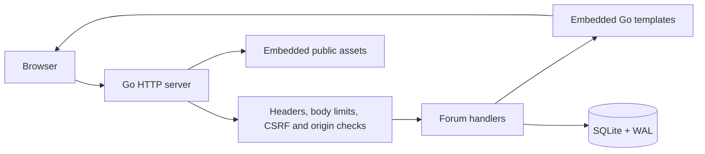

# Architecture

Talknet serves complete HTML pages from Go. SQLite is the source of truth; JavaScript enhances the rendered interface without duplicating the application state in a client framework.

## Request flow

`forum.New` builds an isolated router and template set. Security middleware applies response headers and request limits, issues a random CSRF cookie, and checks state-changing requests against a hidden form token or `X-CSRF-Token`. Go’s cross-origin protection also checks browser request metadata.

The session cookie is a cryptographically random bearer token. Only its SHA-256 hash is stored in `Sessions`. Queries check expiry on every authenticated request; logging in replaces that user’s old session. Logout removes the server record. Sessions survive process restarts and expire after 24 hours.

Authentication attempts are bounded by remote IP, with a one-minute window and ten attempts. The limiter has bounded memory and is local to each process. It intentionally does not trust arbitrary forwarded IP headers.

## Data and consistency

The original users, posts, comments, topics, post/topic links, reactions, and session tables remain compatible. Schema initialization is idempotent. Foreign keys are enabled on the connection; WAL and a five-second busy timeout support normal local concurrency.

A single database connection serializes writes. Transactions commit a post and its topic links together, and serialize reaction toggles so a member has at most one reaction per target through the application. Deferred rollbacks cover every failure path. Query rows are closed before additional queries run to avoid blocking the only connection.

The discussion feed uses a fixed page size of 20, fetching one additional record to discover a next page. Search and topic filters carry through pagination. Detail requests load the requested post directly. Discussion replies are currently rendered as one chronological list.

## Rendering and assets

Templates use Go’s contextual escaping. Templates render to a buffer before writing a response, avoiding a partial HTML success page when rendering fails. The server exposes only the public `styles`, `js`, and `images` paths; template source is not a public asset route.

The binary embeds all assets. Inter is served locally, and the original artwork is delivered as a 1536 × 1024 WebP. The browser makes no font, script, or image requests to third-party services.

## Motion and progressive enhancement

`app.js` uses a passive scroll listener and one animation frame at a time. It moves the hero artwork slightly as the page scrolls and updates reading progress. Intersection Observer reveals individual discussion rows. Essential content is never hidden while waiting for JavaScript.

The motion control remembers a device-local preference. System reduced-motion settings take precedence. Small screens keep the artwork static, and the topic navigation becomes horizontally scrollable. JavaScript adds reaction requests, character counters, password visibility, copy-link feedback, and duplicate-submit protection.

## Scope

This is a discussion application for a single Go process with SQLite storage. Moderation tooling, post editing/deletion, email verification, password recovery, uploads, and multi-instance operation are not implemented. The `/profile?user=` parameter identifies a member; legacy `/profile?id=` links still resolve the author of that post. Liked discussions are visible only to their owner.
